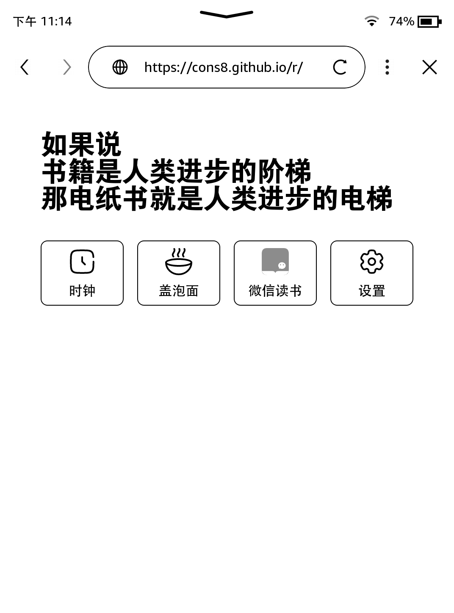

# 墨枢 (MoShu)​
kindle导航/资源整合
## 📖项目简介
专为Kindle浏览器设计的沉浸式导航系统，整合资源聚合、书籍推荐、工具集成三大核心模块
因电子墨水屏幕的特性导致在显示UI上面临一些问题，如刷新率低，灰度表现不佳，因此在进行页面设计时，尽量使用纯色背景，并尽量使用纯色图标。
## 📚 使用指南
直接访问页面 cons8.github.io/r 即可在线体验
在kindle 浏览器中将链接添加为书签，方便下次访问

## 🌹项目预览

